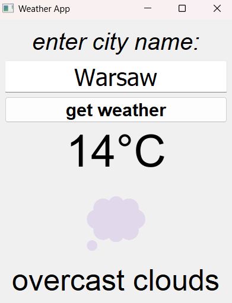

# 🌤️ Weather App API

A clean and user-friendly desktop weather application built with **Python** and **PyQt5** that displays real-time weather information using the **OpenWeatherMap API**.

## 📸 Screenshot

<p align="center">
  
</p>

## 📋 Project Overview

This desktop application provides users with instant weather information for any city worldwide. It features a clean graphical interface with visual weather indicators and comprehensive error handling.

## 🎯 Core Features

* **Real-time Weather Data** - Fetches current weather conditions from the OpenWeatherMap API
* **Temperature Display** - Shows temperature in Celsius with clear formatting
* **Visual Weather Indicators** - Emoji icons representing different weather conditions
* **City Search** - Simple input field for entering any city name
* **Comprehensive Error Handling** - User-friendly messages for API errors, network issues, and invalid inputs

## 🎨 Weather Emoji Mapping

| Weather Condition | ID Range | Emoji |
| ----------------- | -------- | ----- |
| Thunderstorm      | 200-232  | ⛈️    |
| Drizzle           | 300-321  | ☁️    |
| Rain              | 500-531  | 🌧️   |
| Snow              | 600-622  | ❄️    |
| Mist/Fog          | 701-741  | 🌫️   |
| Volcano           | 762      | 🌋    |
| Sandstorm         | 771      | 💨    |
| Tornado           | 781      | 🌪️   |
| Clear Sky         | 800      | ☀️    |
| Clouds            | 801-804  | 💭    |

## 🛠️ Technologies Used

* **Python 3.7+** - Core programming language
* **PyQt5** - GUI framework for the desktop application
* **Requests** - HTTP library for making API requests
* **OpenWeatherMap API** - Weather data provider

## 📁 Project Structure

```text
Weather-App-API/
│
├── weather_app_api.py      # Main application code
├── requirements.txt        # Python dependencies
├── .env.example            # Example environment variables
├── .gitignore              # Git ignore rules
├── LICENSE                 # MIT License
├── screenshot.png          # Application screenshot
└── README.md               # Project documentation
```

## ⚙️ Installation & Setup

### 1. Clone the Repository

```bash
git clone https://github.com/mohamed-tamer-UT/Weather-App-API.git
cd Weather-App-API
```

### 2. Install Dependencies

```bash
pip install -r requirements.txt
```

### 3. Configure the API Key

Create a `.env` file in the project directory:

```env
API_KEY=your_openweathermap_api_key
```

Replace `your_openweathermap_api_key` with your API key from OpenWeatherMap.

> **Note:** Never commit your actual API key to GitHub. Make sure `.env` is included in your `.gitignore` file.

### 4. Run the Application

```bash
python weather_app_api.py
```

## 🐛 Error Handling

The application handles various error scenarios:

| HTTP Status | Error Type            |
| ----------- | --------------------- |
| 400         | Bad Request           |
| 401         | Unauthorized          |
| 403         | Forbidden             |
| 404         | Not Found             |
| 500         | Internal Server Error |
| 502         | Bad Gateway           |
| 503         | Service Unavailable   |
| 504         | Gateway Timeout       |

### Additional Error Handling

* Connection errors
* Timeout errors
* Too many redirects
* General request exceptions
* Missing API key detection
* Invalid city names
* API authentication errors

## 🔐 Environment Variables

The application uses an environment variable to securely store the OpenWeatherMap API key.

Example `.env` file:

```env
API_KEY=your_api_key_here
```

The actual `.env` file should **never** be uploaded to GitHub.

## 📄 License

This project is licensed under the **MIT License**.

## 👤 Author

**Mohamed Tamer**

* GitHub: [@mohamed-tamer-UT](https://github.com/mohamed-tamer-UT)

## 🙏 Acknowledgments

* [OpenWeatherMap](https://openweathermap.org/) for providing the weather API
* [PyQt5](https://www.riverbankcomputing.com/software/pyqt/) for the GUI framework

## ⭐ Support

If you find this project useful, please give it a star ⭐ on GitHub!

---

<p align="center">
  Made with ❤️ by <strong>Mohamed Tamer</strong>
</p>
